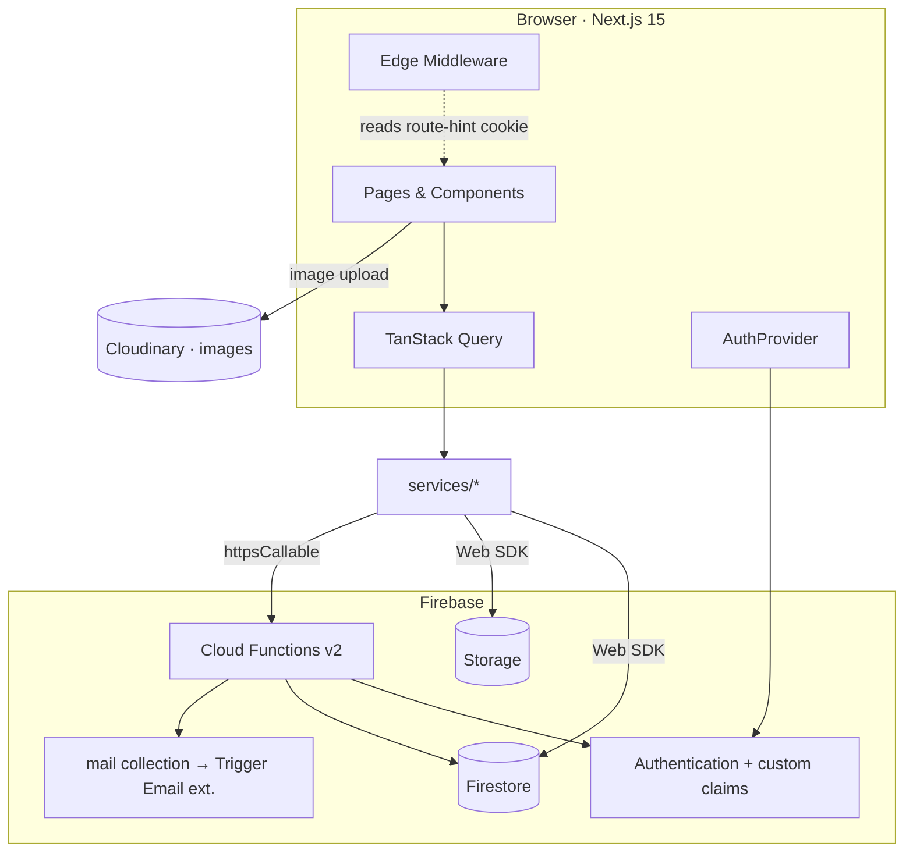

# 04 — System Architecture

## Overview

The EPMS is a **client-rendered Next.js App Router application** talking directly to Firebase from the browser via the Firebase Web SDK, with a thin layer of **Cloud Functions** for privileged operations (OTP, custom tokens, recruiter registration, admin actions). Media goes to **Cloudinary**; documents go to **Firebase Storage**.

## Frontend architecture

- **Routing layer (`app/`)** — App Router, route groups per audience, layouts compose the shell + guards. Pages import features and render them.
- **Feature modules (`features/*`)** — isolated business logic (components/hooks/services/lib/types + barrel).
- **Shared foundation** — `components/ui` (primitives), `components/layout`, `components/shared`, `lib/`, `hooks/`, `providers/`, `config/`, `constants/`, `types/`.
- **Rendering:** Server Components by default; interactive/auth-bound pages are Client Components under role layouts. `useSearchParams` is wrapped in `<Suspense>`.

## Backend architecture

- **Firebase-first**: no custom Node server. The browser uses the Firestore/Storage Web SDK directly, gated by Security Rules.
- **Cloud Functions v2** (region `asia-south1`) for operations that must not run on the client: OTP generation/verification, custom-token minting, recruiter account creation with role claims, admin approvals.
- **Email** via the `mail` Firestore collection consumed by the "Trigger Email from Firestore" extension (swappable for SendGrid/SMTP).

## Authentication (summary)

Custom-claim roles (`student|recruiter|admin`). Student sign-in is **email OTP → custom token** (Firebase has no native email OTP). Recruiter and admin use email/password. Full detail: [07_AUTHENTICATION_SYSTEM](./07_AUTHENTICATION_SYSTEM.md).

## Firestore

Document database, no joins. Data is **keyed by uid** for per-user docs and **denormalized** (e.g., an `application` embeds an `applicant` snapshot + drive summary) so lists render from a single query. Rules are the authorization boundary. Detail: [05](./05_DATABASE_ARCHITECTURE.md), [16](./16_FIRESTORE_COLLECTIONS.md).

## Storage & Cloudinary (the split)

| Store | Used for | Code |
|-------|----------|------|
| **Cloudinary** (unsigned upload) | profile photo, passport photo, (future) logos/banners | `lib/cloudinary/upload.ts` |
| **Firebase Storage** | resume PDF, marksheets, certificates | `lib/storage/upload.ts` (path `students/{uid}/…`) |

## State management

| Kind | Tool | Examples |
|------|------|----------|
| Server/remote data | TanStack Query | drives, applications, profile, notifications |
| Auth session | React Context (`AuthProvider`) | user, role, status, student profile meta |
| Ephemeral UI | local `useState` (+ `localStorage`) | sidebar collapsed, wizard step, filters |
| Forms | React Hook Form + Zod | wizard, auth forms, settings |
| URL | `useSearchParams` | `?q=`, `?step=` |

Golden rule: remote data belongs to Query, never mirrored into a store. Detail in the SDD [state doc](./architecture/10-state-management.md).

## Routing & middleware

- Public: `/`, `/login`, `/recruiter/login`, `/recruiter/register`, `/admin/login`, `/forgot-password`, `/verify-email`, `/unauthorized`.
- Protected: student pages (`/dashboard`, …), `/onboarding`, `/recruiter*`, `/admin*`.
- **`middleware.ts`** (edge) reads a non-sensitive route-hint cookie and performs early redirects (unauth → role login; wrong role → `/unauthorized`; incomplete student → `/onboarding`; unapproved recruiter → `/recruiter/pending`; signed-in on guest page → home). It is **UX routing, not security**.

## Performance

- Server Components + code splitting per route; Query dedupes shared reads (e.g., notifications used by bell + right panel + page = one fetch).
- Bundles are modest (largest first-load `/onboarding` ≈ 376 kB). Cloudinary/Storage URLs are immutable & hashed → long browser cache.
- **Improvement opportunities:** lazy-load onboarding wizard steps and future charts via `next/dynamic`; precompute admin analytics server-side.

## Security (summary)

Firestore Rules + custom claims are authoritative; OTPs hashed + rate-limited; storage owner-scoped; middleware documented as UX-only. Detail: [13_SECURITY](./13_SECURITY.md).

## Scalability

Stateless frontend (Vercel), auto-scaling Firestore/Functions, denormalized reads to avoid N+1, and feature modules that can graduate into packages. Multi-institute/multi-tenant is a future consideration.
