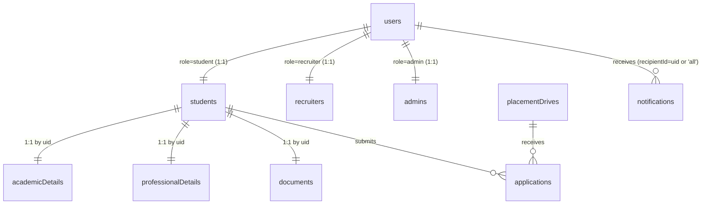

# 05 — Database Architecture

Cloud Firestore is the system of record. This document explains the **model and relationships**; per-collection field/rule detail is in [16_FIRESTORE_COLLECTIONS](./16_FIRESTORE_COLLECTIONS.md).

## Design rules the code follows

1. **Key by identity** — per-user documents use the Firebase `uid` as the document id (`students/{uid}`).
2. **Denormalize for reads** — embed the snapshot a screen needs so lists render from one query (e.g., `applications/{id}.applicant` and the drive summary).
3. **Deterministic ids for uniqueness** — an application id is `` `${studentId}_${driveId}` `` so a student can apply once per drive without a query.
4. **Server timestamps** — `serverTimestamp()` for `createdAt`/`updatedAt`/`lastLogin`.
5. **Batched writes** for multi-doc operations (onboarding writes 4 docs; applying writes application + notification).

## Implemented collections

| Collection | Doc id | Written by |
|------------|--------|------------|
| `users` | `{uid}` | Cloud Functions (create) · student self (limited update) · admin |
| `students` | `{uid}` | student self · verifyOtp (seed) |
| `academicDetails` | `{uid}` | student self |
| `professionalDetails` | `{uid}` | student self |
| `documents` | `{uid}` | student self |
| `recruiters` | `{uid}` | registerRecruiter fn · admin |
| `admins` | `{uid}` | `seed-admin.mjs` (Admin SDK) |
| `placementDrives` | auto | admin/recruiter (Admin SDK / seed) — students read only |
| `applications` | `{uid}_{driveId}` | student (create) · recruiter/admin (status) |
| `notifications` | auto | functions · student self (own) |
| `otpRequests` | `sha256(email)` | Cloud Functions only |
| `mail` | auto | Cloud Functions only (email queue) |

**Not Yet Implemented as collections:** `interviews`, `offers`, `companies`, `announcements` (announcements are `notifications` with `type='announcement'`), `certificates`, `activityLogs`, `supportTickets`, `settings`, `analytics`. These are designed in the SDD but not created by the current code.

## Entity relationships (actual)



## Access patterns → queries → indexes

| Screen | Query | Index needed |
|--------|-------|--------------|
| Student drive feed | `placementDrives where status=='published'` | single-field (auto) |
| My applications | `applications where studentId==uid` | single-field (auto) |
| My notifications | `notifications where recipientId in [uid,'all']` | single-field (auto) |
| Companies page | derived client-side from published drives | none |

`Backend/firestore.indexes.json` currently declares **no composite indexes** — all live queries are single-field and sort client-side. Composite indexes (e.g., `applications(driveId,status)`) will be added with the recruiter/admin phases.

## Onboarding write (transactional)

`onboardingService.save()` performs one **batched write**:

```
batch.set(students/{uid}, {…personal, profileCompleted:true, completionPercentage, sections})
batch.set(users/{uid},    {profileCompleted:true, verificationStatus:'pending'}, merge)
batch.set(academicDetails/{uid}, {…}, merge)
batch.set(professionalDetails/{uid}, {…}, merge)
batch.set(documents/{uid}, {…}, merge)
```

`undefined`/empty values are stripped before writing (Firestore rejects `undefined`).

## Apply write (transactional)

`applicationsService.apply()` batches:

```
batch.set(applications/{uid}_{driveId}, { …driveSnapshot, status:'pending',
          timeline:[{status:'pending', atMs}], applicant:{…profile snapshot} })
batch.set(notifications/{auto}, { recipientId:uid, type:'application', … })
```

Idempotency is enforced by reading the deterministic-id doc first (throws "already applied" if present).

## Data integrity notes

- Denormalized snapshots are **immutable copies** at write time; the live source remains the profile.
- Application **status transitions** are performed by recruiters/admin via the Admin SDK (client `update` is denied by rules) — this keeps the timeline authoritative. UI for this is **Not Yet Implemented** (Phase 5/6); today, statuses can be advanced via console/Admin SDK/seed.
