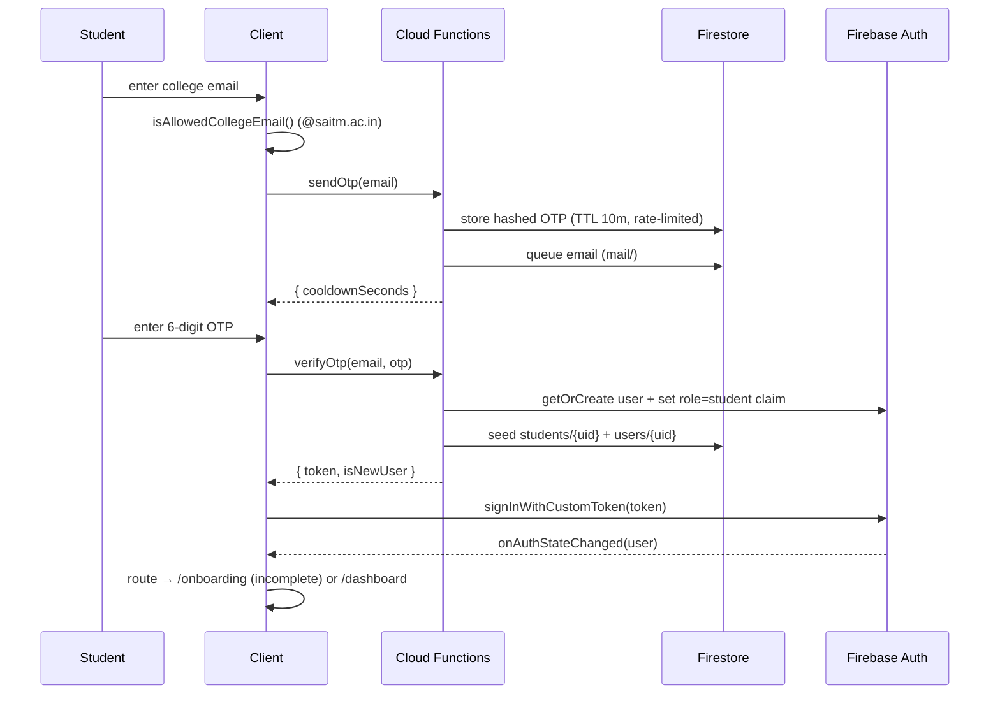

# 07 — Authentication System

## Overview

Three roles — `student`, `recruiter`, `admin` — each with a distinct sign-in method, all backed by Firebase Authentication with **custom-claim roles**. Role is authoritative from the ID-token claim; `users/{uid}.role` mirrors it.

| Role | Method | Route | Gate after login |
|------|--------|-------|------------------|
| Student | Email **OTP** (`@saitm.ac.in` only) | `/login` | onboarding if profile incomplete |
| Recruiter | Email + password | `/recruiter/login`, `/recruiter/register` | email verify → **admin approval** |
| Admin | Email + password (role-validated) | `/admin/login` | — (provisioned out-of-band) |

## Key files

| Concern | File |
|---------|------|
| Firebase client | `lib/firebase/client.ts` |
| Email domain gate | `lib/auth/email-domain.ts` |
| Route-hint cookie | `lib/auth/route-hint.ts` |
| Auth context/provider | `contexts/auth-context.tsx`, `providers/auth-provider.tsx` |
| `useAuth()` | `hooks/auth/use-auth.ts` |
| Student OTP service | `features/auth/services/auth.service.ts` |
| Recruiter service | `features/auth/services/recruiter-auth.service.ts` |
| Admin service | `features/auth/services/admin-auth.service.ts` |
| Guards | `components/shared/require-auth.tsx`, `require-role.tsx` |
| Middleware | `middleware.ts` |
| Functions | `Backend/functions/src/callable/*` |

## 1. Student — Email OTP



**OTP hardening** (in `Backend/functions/src/lib/otp.ts` + `callable/send-otp.ts`): SHA-256 + server pepper hash, 10-minute expiry, 45-second resend cooldown, ≤5 sends/hour, ≤5 verify attempts. UI: `AuthCard` → `EmailStep` / `OtpStep` / `OtpInput`; state machine in `useOtpAuth`.

## 2. Recruiter — Verified + Admin-Approved

```mermaid
flowchart TD
    R[/recruiter/register/] --> Fn[registerRecruiter fn]
    Fn --> Claim[role=recruiter claim + approvalStatus=pending]
    Fn --> Mail[email-verification link]
    Claim --> Login[/recruiter/login/]
    Login --> Landing[/recruiter landing]
    Landing --> V{emailVerified?}
    V -- no --> VN[VerifyEmailNotice]
    V -- yes --> Ap{approvalStatus}
    Ap -- pending/rejected --> W[WaitingForApproval]
    Ap -- approved --> WS[Approved workspace stub]
```

- `registerRecruiter` (server) creates the account so the **role claim is set before sign-in**. Reserved: `@saitm.ac.in` is rejected (student domain).
- Approval is performed by the `approveRecruiter` callable (admin-only). Admin UI to trigger it is **Not Yet Implemented** (Phase 6).

## 3. Admin — Secure, role-validated

- No public signup. Provisioned via `Backend/functions/seed-admin.mjs` (sets `role=admin` claim + `users`/`admins` docs).
- `adminAuthService.login()` signs in, force-refreshes the token, and **rejects any non-admin** (signs them out). 2FA-ready (not enabled).

## AuthProvider & session

`AuthProvider` subscribes to `onAuthStateChanged` and, per user, resolves:

```ts
{ user,            // Firebase User
  role,            // from ID-token claim
  status,          // AuthStatus from users/{uid}: profileCompleted, verificationStatus,
                   //   approvalStatus, isActive, rejectionReason
  profile }        // StudentProfileMeta from students/{uid} (name, photo, completion%)
```

Exposed via `useAuth()` with `refreshProfile()` (reloads the Firebase user for emailVerified/claim changes) and `signOut()`. Sessions persist via the Firebase SDK (IndexedDB) with automatic token refresh ("auto login"/persistent login). On resolve it writes a **route-hint cookie**.

## Route protection (three layers)

1. **Firestore Rules** — the real boundary (role claim + ownership + status).
2. **Cloud Functions** — privileged transitions (claims, approvals, tokens).
3. **Client guards + middleware** — UX redirects.

**Guards:**
- `RequireAuth` — signed-in; optional `role` (mismatch → `/unauthorized`), `requireComplete` (student → `/onboarding`), `requireApproved` (recruiter → `/recruiter/pending`).
- `RequireRole` — thin wrapper over `RequireAuth` with a role.

**Middleware** (`middleware.ts`, edge): reads the route-hint cookie and redirects — unauth protected → role login; wrong role → `/unauthorized`; incomplete student → `/onboarding`; unapproved recruiter → `/recruiter/pending`; signed-in on a guest page → role home. Login handlers write a **provisional** cookie before navigating to avoid a post-login bounce.

> ⚠️ **The route-hint cookie is non-sensitive and could be forged; middleware is UX routing only.** Firestore Rules + claims enforce real authorization, and client guards re-check on mount.

## Validation

- Email: Zod `emailSchema` + `isAllowedCollegeEmail()` (client) and re-validated in `sendOtp`/`verifyOtp` (server).
- OTP: Zod `otpSchema` (`^\d{6}$`).
- Recruiter register: Zod `recruiterRegisterSchema` (password ≥ 8, confirm match, work-email, terms). Admin/recruiter login: `loginSchema`.

## States & edge cases

| State | Handling |
|-------|----------|
| Loading | button spinners, `FullScreenLoader` during auth resolve |
| Success | sonner toasts; optimistic redirect |
| Error | mapped, human messages (invalid domain, wrong code/expired, too many attempts, wrong password) |
| Wrong role login | signed out with an explanatory error |
| Rejected recruiter | `WaitingForApproval` shows the rejection reason |
| Rejected student verification | notification + `verificationStatus:'rejected'` (placement gating is Phase 5/6) |

## Not Yet Implemented

- 2FA for admin (UI/enforcement), social logins, "remember me" explicit toggle (session already persists), true server-side session cookies (firebase-admin) for edge verification.
