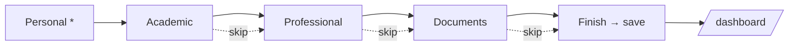
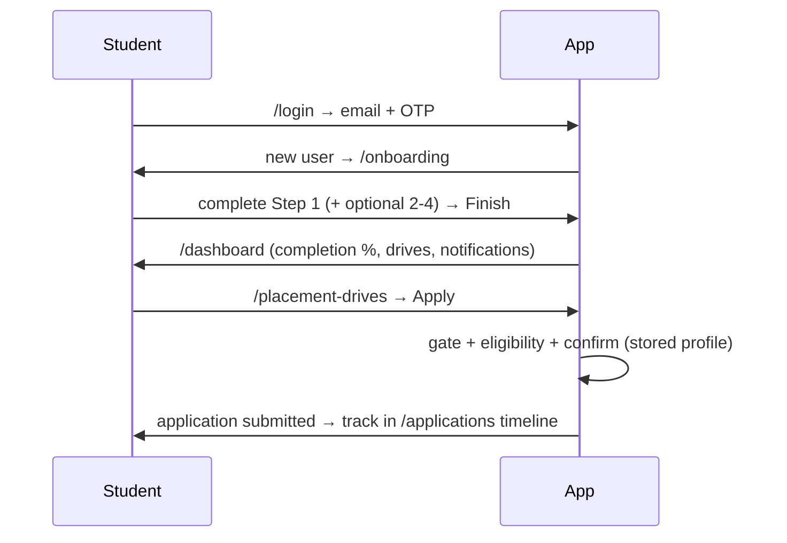

# 08 — Student Module

The most complete module. This documents **exactly what is implemented**; unbuilt features from product briefs are listed under [Not Yet Implemented](#not-yet-implemented).

## Route map

| Route | Page | Status |
|-------|------|--------|
| `/login` | Student email-OTP sign-in | ✅ |
| `/onboarding` | 4-step profile wizard (`?step=N` deep-link) | ✅ |
| `/dashboard` | Dashboard home (widgets) | ✅ |
| `/profile` | Profile view (read-only, edit links to wizard) | ✅ |
| `/placement-drives` | Browse drives + search + apply | ✅ |
| `/companies` | Companies derived from drives | ✅ |
| `/applications` | My applications + filters + timeline | ✅ |
| `/interviews` | Applications with `interview_scheduled` status | ✅ |
| `/resume` | Resume status + upload/replace | ✅ |
| `/documents` | All uploaded documents | ✅ |
| `/skills` | Skills / languages / certifications view | ✅ |
| `/notifications` | Full notifications list | ✅ |
| `/announcements` | Notifications of `type='announcement'` | ✅ |
| `/settings` | Notification prefs, privacy, connected links, logout | ✅ |
| `/help` | Static FAQ + TPO contact | ✅ |

All student routes are wrapped by `app/(student)/layout.tsx`: `RequireAuth role="student" requireComplete` + the shell (sidebar/topbar/right-panel).

## Feature index (implemented) with data & code

| Feature | Page/Component | Service / Hook | Collections |
|---------|----------------|----------------|-------------|
| OTP login | `features/auth` → `AuthCard` | `authService`, `useOtpAuth` | `otpRequests`, `mail`, `users`, `students` |
| Onboarding | `features/onboarding` → `OnboardingWizard` | `onboardingService`, `useOnboarding` | `students`, `academicDetails`, `professionalDetails`, `documents`, `users` |
| Dashboard | `features/dashboard` → `DashboardHome` | `useFullProfile`, `useDrives`, `useMyApplications`, `useNotifications` | reads all |
| Full profile | `useFullProfile` | `profileService.getFull` | 4 profile collections |
| Drives | `features/placement-drives` → `DriveCard` | `useDrives`, `drivesService` | `placementDrives` |
| Apply | `features/applications` → `ApplyButton`/`ApplyDialog` | `useApplyToDrive`, `applicationsService` | `applications`, `notifications` |
| Applications | `ApplicationRow`, `StatusTimeline`, `ApplicationStats` | `useMyApplications` | `applications` |
| Notifications | `features/notifications` → `NotificationBell`, `NotificationItem` | `useNotifications` | `notifications` |

## 1. Onboarding wizard (`/onboarding`)

Four steps; **Step 1 mandatory**, Steps 2–4 optional/skippable. Framer Motion transitions; `StepIndicator` shows "Step X of 4" + progress.

| Step | Fields (validated via Zod) | Required? |
|------|----------------------------|-----------|
| **1 Personal** | fullName, gender, dateOfBirth (age 15–60), mobile (`^[6-9]\d{9}$`), alternate mobile, aadhaar (12 digits), category, blood group, address, city, state, pincode (6 digits), **profile photo → Cloudinary** | ✅ mandatory (Continue only) |
| **2 Academic** | enrollment/roll no., course, branch, year, semester, section, admission/passing year, 10th/12th/diploma %, CGPA (0–10), active/total backlogs, academic gap, academic status | Optional (Prev/Skip/Continue) |
| **3 Professional** | skills, languages, frameworks, technologies, certifications (tag inputs), projects (repeater), internship/work experience, GitHub/LinkedIn/portfolio/LeetCode/HackerRank/CodeChef/Codeforces | Optional |
| **4 Documents** | resume PDF, passport photo (Cloudinary), 10th/12th marksheets, semester marksheets (multi), certificates (multi) — docs → **Firebase Storage** | Optional (Finish) |

- **Finish** → `onboardingService.save()` (batched write of 4 collections + `users`), sets `profileCompleted=true`, `completionPercentage`, per-section flags, and `users.verificationStatus='pending'`; invalidates `['full-profile', uid]`; routes to `/dashboard`.
- **Completion %** — weighted by section (`computeCompletion` in `features/onboarding/lib/profile-completion.ts`): Personal 40, Academic 25, Professional 20, Documents 15.
- **Edit later** — dashboard/profile deep-link `/onboarding?step=N`; the wizard pre-loads existing data so partial edits don't drop the percentage.

## 2. Dashboard (`/dashboard`)

`DashboardHome` composes: **WelcomeHero** (name, course, branch, year, completion ring), **quick actions**, **StatTiles** (Applications / Interviews / Selected+Offers / Active Drives), **CompletionCard** (missing sections with deep links), **Upcoming Drives** (top 3 `DriveCard` + `ApplyButton`), **Recently Applied**, **ApplicationStats** donut, **Upcoming Interviews**, **Announcements**, **Recent Activity**. Empty/loading states throughout (`EmptyState`, `Skeleton`).

## 3. Shell — Sidebar / Navbar / Right panel

- **Sidebar** (`components/layout/app-sidebar.tsx`): collapsible (persisted to `localStorage`), grouped nav (Overview / Placements / Account), animated active highlight (`layoutId`), mobile drawer.
- **Topbar** (`app-topbar.tsx`): search (routes to `/placement-drives?q=`), **NotificationBell** (unread badge + preview), quick-actions menu, profile-completion ring, avatar menu (profile/settings/logout).
- **Right panel** (`right-panel.tsx`, `xl+`): profile strength + recent activity (hidden on `/dashboard`).

## 4. Profile (`/profile`)

Read-only view of all four profile collections (`useFullProfile`): header (avatar, name, contact, completion %), Personal, Academic, Professional (skills chips, projects, links), Documents (view links). Each section "Edit" deep-links to the matching onboarding step.

## 5. Placement drives (`/placement-drives`) + Apply

- Grid of `DriveCard` (logo, role, company, package, location, openings, eligibility chips, deadline label, "View details" dialog, `ApplyButton`). Client-side search by company/role/location (`?q=`).
- **Apply flow** (`ApplyDialog`): (1) profile-completeness **gate** → lists missing critical items with deep links; (2) **eligibility** check (`checkEligibility`) → shows specific reasons; (3) **confirm** using stored profile → one-click submit; (4) **success**. Detail: [11_APPLICATION_FLOW](./11_APPLICATION_FLOW.md).
- **Companies** (`/companies`): unique companies derived from published drives with open-role counts.

## 6. My applications (`/applications`) & Interviews (`/interviews`)

- `ApplicationStats` donut (status breakdown, reserved status colors + labels), status **filter chips**, and `ApplicationRow` cards with a **status timeline** dialog (`StatusTimeline`).
- Statuses: `pending → under_review → shortlisted → interview_scheduled → selected → offer_released` (or `rejected`).
- `/interviews` filters applications to `interview_scheduled` (reuses `ApplicationRow`).

## 7. Notifications (`/notifications`) & Announcements (`/announcements`)

- `useNotifications` queries `notifications where recipientId in [uid,'all']`, sorts newest-first. Unread badge counts **personal** unread only. Mark-one / mark-all read (personal only — broadcasts are shared). `/announcements` filters `type='announcement'`. Types: drive, interview, selection, announcement, application, document, system. Detail: [12_NOTIFICATION_SYSTEM](./12_NOTIFICATION_SYSTEM.md).

## 8. Resume / Documents / Skills

- **/resume** — shows resume status (uploaded/attached) with view + replace (→ onboarding step 4).
- **/documents** — lists all uploaded docs (resume, passport photo, 10th/12th, semester marksheets, certificates) with view links; empty state → upload CTA.
- **/skills** — displays skills, programming languages, frameworks/technologies, certifications as chips; edit → onboarding step 3.

## 9. Settings (`/settings`)

Account (email, verified badge, edit profile), Security (OTP note — no password), **Notification Preferences** toggles, **Privacy** (recruiter-visibility toggle), Connected Accounts (GitHub/LinkedIn), Logout. Save writes `{ notificationPrefs, recruiterVisible }` to `students/{uid}`.

## 10. Help (`/help`)

Static FAQ (why can't I apply, how applications submit, status timeline, wrong email) + TPO contact. No ticketing.

## Business & validation rules

- Only `@saitm.ac.in` students may sign in.
- A student **cannot apply** unless `profileCompleted` **and** all critical items present (resume, skills, CGPA, course, branch) **and** eligible for the drive.
- One application per `(student, drive)` (deterministic id).
- Applying uses the **stored profile snapshot** — no re-entry.
- All field validation is Zod-derived (types inferred via `z.infer`).

## States (implemented everywhere)

Loading → `Skeleton` / spinners · Empty → `EmptyState` · Error → toasts + route `error.tsx` · Success → toasts + optimistic UI.

## Not Yet Implemented

These appear in product briefs but are **not built** (no invented docs):

- Resume Builder · Resume Analyzer / scoring (`resumeScore` reserved only)
- Placement Readiness score · Career Roadmap · Company Recommendations
- Saved Companies · Placement Calendar · Achievements
- AI Career Assistant · Mock Interview · Learning Center · Community
- Portfolio · Public Profile
- Dedicated **Offer Letters** module (offers collection/UI) — offers are Not Yet Implemented
- **Interview scheduling** as its own entity (interviews are derived from application status; no `interviews` collection/UI)
- Support Center **ticketing** (Help is a static FAQ)
- Student **admin-verification gating** of placement actions (onboarding sets `verificationStatus='pending'`, but placement pages are not yet gated on `'verified'`)
- FCM push notifications

## User journey (happy path)

