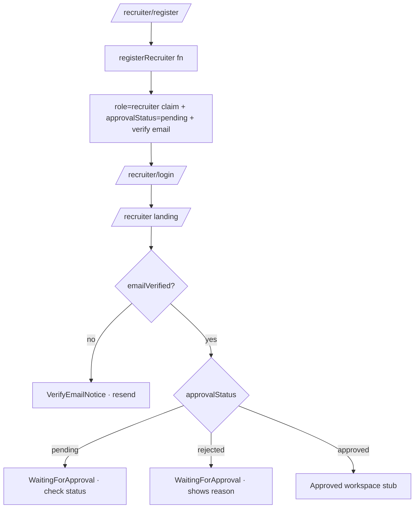

# 09 — Recruiter Module

> **Implementation status:** the recruiter **authentication and gating** flow is fully built. The **hiring workspace** (company profile, drive creation, applicants, shortlisting, interviews, offers, reports, analytics) is **Not Yet Implemented** — the approved-recruiter landing is currently a placeholder. This document describes what exists and clearly labels the rest.

## Route map

| Route | Page | Status |
|-------|------|--------|
| `/recruiter/register` | Registration form | ✅ |
| `/recruiter/login` | Email/password sign-in | ✅ |
| `/recruiter` | Landing: verify → pending → approved stub | ✅ |
| `/recruiter/pending` | Waiting-for-approval screen | ✅ |
| `/recruiter/dashboard`, `/recruiter/jobs`, `/recruiter/candidates`, `/recruiter/interviews`, `/recruiter/offers`, … | Hiring workspace | 🟥 Not Yet Implemented |

`app/recruiter/layout.tsx` guards everything under `/recruiter/*` with `RequireRole role="recruiter"`, **except** the public `/recruiter/login` and `/recruiter/register`.

## Authentication (implemented)

- **Registration** (`RecruiterRegisterForm` + `recruiterAuthService.register`) calls the `registerRecruiter` callable, which creates the account **server-side** (so the `role=recruiter` claim is set before first sign-in), sets `approvalStatus:'pending'`, writes `users/{uid}` + `recruiters/{uid}`, and queues an email-verification link. `@saitm.ac.in` is rejected (reserved for students).
- **Login** (`RecruiterLoginForm` + `recruiterAuthService.login`) signs in with email/password, refreshes the token, and verifies the `recruiter` claim (else signs out).
- **Landing** (`app/recruiter/page.tsx`) branches on `user.emailVerified` and `status.approvalStatus`:
  - not verified → `VerifyEmailNotice` (resend link, "I've verified" refresh)
  - not approved → `WaitingForApproval` (check-status refresh; rejection reason if rejected)
  - approved → workspace placeholder ("hiring modules arrive in Phase 5").

### Validation rules

`recruiterRegisterSchema` (Zod): fullName ≥ 2; work email (not `@saitm.ac.in`); company ≥ 2; password ≥ 8 with confirm match; optional designation/phone/website; terms accepted.

## Firestore (implemented)

- **`recruiters/{uid}`** — `uid, email, fullName, designation, phone, companyName, companyWebsite, emailVerified, approvalStatus, createdAt`. Read own/admin; write admin (functions bypass). Created by `registerRecruiter`; `approvalStatus` set by `approveRecruiter`.
- **`users/{uid}`** — role `recruiter`, `approvalStatus`, `isActive` (false until approved).

## Approval (backend)

`approveRecruiter` callable (**admin only**) sets `approvalStatus` + `isActive` on `users` and `recruiters`, and emails the recruiter on approval. **The admin UI to invoke it is Not Yet Implemented** (Phase 6); today it is called via the Admin SDK / a future admin console.

## Components (implemented)

| Component | File |
|-----------|------|
| `RecruiterRegisterForm` | `features/auth/components/recruiter-register-form.tsx` |
| `RecruiterLoginForm` | `features/auth/components/recruiter-login-form.tsx` |
| `WaitingForApproval` | `features/auth/components/waiting-for-approval.tsx` |
| `VerifyEmailNotice` | `features/auth/components/verify-email-notice.tsx` |
| `AuthShell` (branded wrapper) | `components/layout/auth-shell.tsx` |

## Not Yet Implemented (designed in the SDD, not built)

Company profile management · **Create placement drive** (with eligibility rules) · drive approval workflow · applicants list · resume review · shortlisting · interview scheduling · offer management · recruiter notifications feed · reports · analytics · recruiter settings · the `companies`, `interviews`, `offers` collections and their rules/UI.

See [`docs/architecture/11-feature-mapping.md`](./architecture/11-feature-mapping.md) for the designed module → collections → components mapping that Phase 5 will implement.
