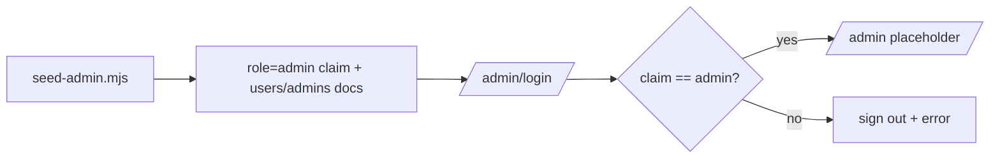

# 10 — Admin Module

> **Implementation status (honest):** the admin **secure login with strict role validation** and the **two admin backend operations** (`approveRecruiter`, `reviewStudent`) are implemented. The **admin console UI** (dashboard, verification queue, approvals, company/drive management, analytics, reports, announcements, audit logs, role management, settings) is **Not Yet Implemented** — `/admin` is currently an authenticated placeholder. Nothing below is invented; unbuilt areas are labeled.

## Route map

| Route | Page | Status |
|-------|------|--------|
| `/admin/login` | Secure email/password login (role-validated) | ✅ |
| `/admin` | Authenticated placeholder ("console arrives later") | ✅ |
| `/admin/students`, `/admin/recruiters`, `/admin/companies`, `/admin/placement-drives`, `/admin/applications`, `/admin/analytics`, `/admin/reports`, `/admin/announcements`, `/admin/activity-logs`, `/admin/settings`, `/admin/user-management` | Console modules | 🟥 Not Yet Implemented |

`app/admin/layout.tsx` guards `/admin/*` with `RequireRole role="admin"`, except the public `/admin/login`.

## Provisioning & login (implemented)

- **No public admin signup.** Admins are provisioned out-of-band by `Backend/functions/seed-admin.mjs`, which creates the user, sets the `role=admin` claim, and writes `users/{uid}` + `admins/{uid}` (`level: super_admin`, `permissions: ["*"]`).
- **Login** (`AdminLoginForm` + `adminAuthService.login`): `signInWithEmailAndPassword` → force token refresh → **reject any non-admin** (sign out with an error). 2FA-ready (UI/enforcement Not Yet Implemented).

## Admin backend operations (implemented callables)

These exist and enforce `request.auth.token.role === 'admin'`. They are the authorization backend for the future console.

| Callable | Effect |
|----------|--------|
| `approveRecruiter({ uid, approve, reason? })` | sets `users/{uid}` + `recruiters/{uid}` `approvalStatus` (+ `isActive`); emails recruiter on approval |
| `reviewStudent({ uid, verified, reason? })` | sets `users/{uid}.verificationStatus` = `verified`/`rejected` (+ `rejectionReason`); notifies the student |

> Until the admin console UI ships (Phase 6), these are invoked programmatically (Admin SDK / callable). There is **no button** in the app to trigger them yet.

## Firestore (implemented)

- **`admins/{uid}`** — `uid, email, fullName, level, permissions, createdAt`. Read own/admin; **write denied** to all clients (Admin SDK only).
- Admin **read scope**: rules grant `isAdmin()` read across `users`, `students`, `academicDetails`, `professionalDetails`, `documents`, `recruiters` (for the future console). Privileged writes are via Admin SDK/callables.

## Data the console will manage (already in the DB)

`users`, `students` (+ academic/professional/documents), `recruiters`, `placementDrives`, `applications`, `notifications`. Collections the console needs that are **Not Yet Implemented**: `companies`, `interviews`, `offers`, `activityLogs`, `supportTickets`, `settings`, `analytics`, and a dedicated `announcements` collection (announcements currently ride on `notifications` with `type='announcement'` / `recipientId='all'`).

## Not Yet Implemented (designed, not built)

Dashboard & KPIs · Student verification **queue UI** · Recruiter approval **queue UI** · Company management · Placement-drive approval/publish UI · Analytics & Reports · Downloads/exports · Filters & search · Bulk email · Announcement composer · Audit logs viewer · Role management · Permissions UI · System configuration · Monitoring · Activity logs.

The designed navigation, routes, permission matrix, and component plan for these are specified in the SDD:
- [`architecture/06-navigation-structure.md`](./architecture/06-navigation-structure.md) (admin nav)
- [`architecture/07-routing-structure.md`](./architecture/07-routing-structure.md) (admin routes)
- [`architecture/05-security-rules.md`](./architecture/05-security-rules.md) (admin permissions)
- [`architecture/11-feature-mapping.md`](./architecture/11-feature-mapping.md) (admin feature → data/components)

> Because most of this module is unbuilt, this file is intentionally **not** padded to be "the biggest." It documents reality; the roadmap ([20](./20_PROJECT_ROADMAP.md)) and SDD carry the full Phase-6 design.
