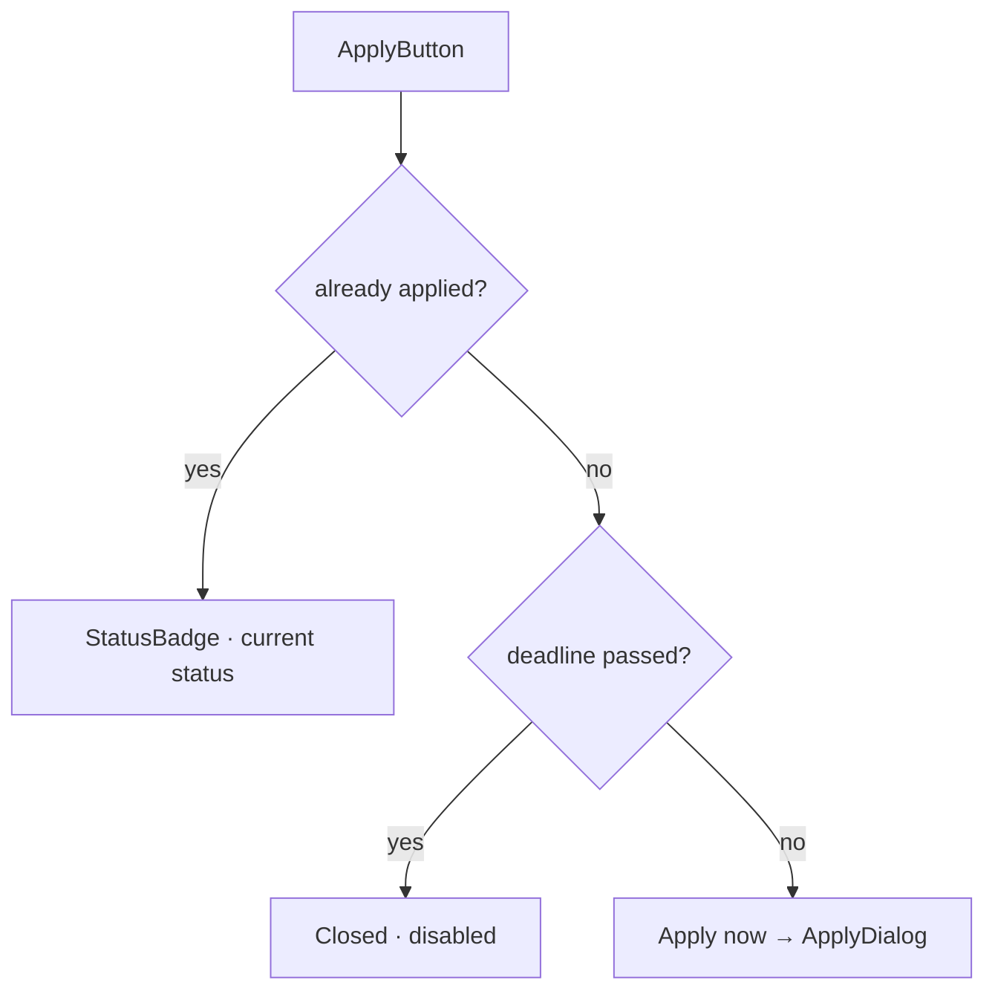
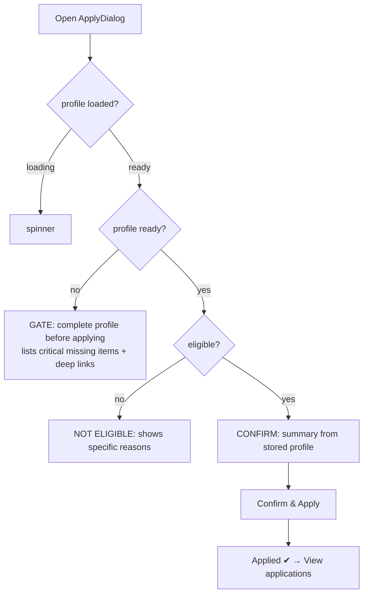
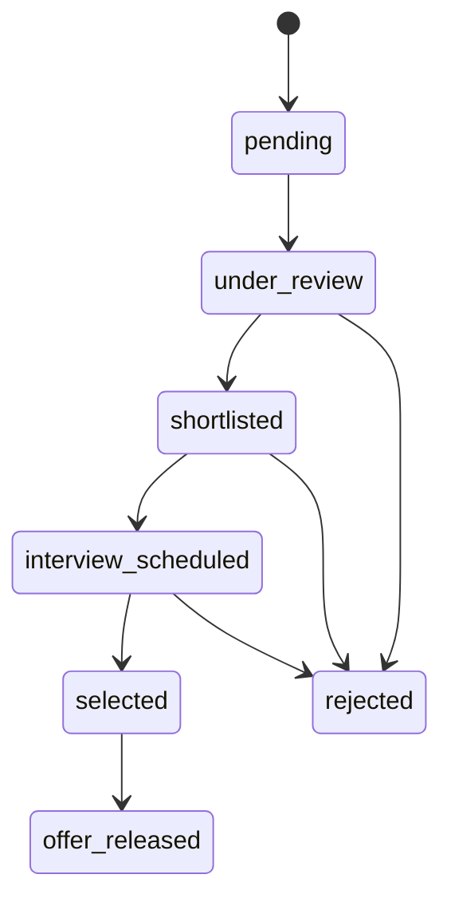

# 11 — Application Flow

The flagship business logic: **profile gate → eligibility check → one-click apply**, with a full status lifecycle. Implemented in `features/applications` (+ `features/profile`, `features/placement-drives`).

## Entry points

`ApplyButton` (in `DriveCard` on `/placement-drives` and `/dashboard`) decides what to render:



## ApplyDialog state machine



### Step 1 — Profile completeness gate

`getApplyReadiness(full)` (`features/profile/lib/missing-sections.ts`) returns `{ ready, missing, criticalMissing }`. **Ready** requires `profileCompleted === true` **and** no critical items missing. Critical items: **Resume, Skills, Current CGPA, Course, Branch**. If not ready, the dialog blocks and shows each missing item with a deep link to `/onboarding?step=N`.

### Step 2 — Eligibility engine

`checkEligibility(full, drive)` (`features/applications/lib/eligibility.ts`) returns `{ eligible, reasons[] }`. It evaluates the drive's `eligibility` object and produces a **specific reason for every failed criterion** (never a silently-disabled button):

| Criterion | Example reason |
|-----------|----------------|
| `courses` | "Open only to B.Tech students." |
| `branches` | "Open only to CSE, IT branch students." |
| `minYear` | "Only 4th+ year students can apply." |
| `minCgpa` | "Minimum CGPA required is 8 — yours is 7.4." |
| `allowBacklogs=false` / `maxActiveBacklogs` | "Active backlogs are not allowed for this drive." |
| `passingYears` | "Only the 2026 passing batch can apply." |
| `requiredSkills` | "Required skill(s) missing: DSA, System Design." |

### Step 3 — One-click confirm & submit

The confirm screen shows a summary built from the **stored profile** (name, course·branch, CGPA, resume-attached). No form. `useApplyToDrive` → `applicationsService.apply(uid, full, drive)`:

```
id = `${uid}_${driveId}`               // deterministic → one per drive
if applications/{id} exists → throw "already applied"
batch.set(applications/{id}, {
  studentId, driveId, companyName, role, companyLogoUrl, packageLabel, location,
  status: 'pending', appliedAt: serverTimestamp(), updatedAt,
  timeline: [{ status:'pending', atMs }],
  applicant: { fullName, email, phone, course, branch, cgpa, resumeUrl, skills, photoUrl }
})
batch.set(notifications/{auto}, { recipientId: uid, type:'application', title, message, link:'/applications' })
batch.commit()
```

On success the mutation invalidates `['applications', uid]` and `['notifications', uid]`, and `ApplyButton` flips to a `StatusBadge`.

## Status lifecycle

`ApplicationStatus` (`features/applications/types.ts`), metadata in `lib/status-meta.ts`:



| Status | Color (reserved) | Badge |
|--------|------------------|-------|
| pending | `#6B7280` | secondary |
| under_review | `#3B82F6` | info |
| shortlisted | `#D8AE3E` | gold |
| interview_scheduled | `#18305F` | primary |
| selected | `#22C55E` | success |
| offer_released | `#059669` | success |
| rejected | `#EF4444` | error |

**Who advances status:** recruiters/admin via the Admin SDK (client `update` on `applications` is **denied by rules**). The **UI to do this is Not Yet Implemented** (Phase 5/6); today status changes are made programmatically/seed, and the student sees them reflected in `/applications`.

## My applications & timeline

- `/applications` — `ApplicationStats` donut + status filter chips + `ApplicationRow` list.
- Each row opens a `StatusTimeline` dialog rendering the `timeline[]` events (status, date, optional note), sorted ascending, colored by status.

## Validation, states, edge cases

| Case | Behavior |
|------|----------|
| Not signed in | guards/middleware redirect to `/login` |
| Profile incomplete | gate blocks with deep links |
| Ineligible | reasons shown; dialog closable (not silently disabled) |
| Deadline passed | `ApplyButton` shows "Closed" |
| Already applied | `ApplyButton` shows current `StatusBadge` |
| Duplicate submit (race) | service re-checks the deterministic-id doc and throws |
| Submit error | `useApplyToDrive.onError` toast |

## Not Yet Implemented

Recruiter/admin **status-transition UI**, interview scheduling entity, offers module, saved/bookmarked drives, application withdrawal.
