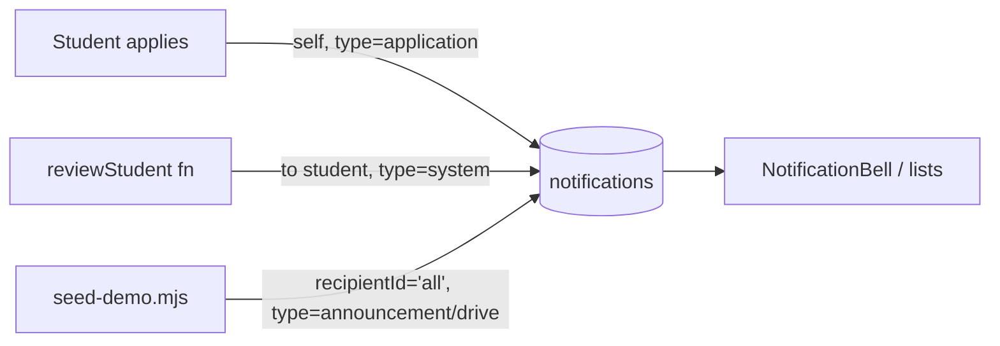

# 12 — Notification System

In-app notifications are implemented (`features/notifications`). **FCM push is Not Yet Implemented.**

## Data model — `notifications/{id}` (auto id)

| Field | Type | Notes |
|-------|------|-------|
| `recipientId` | string | a student `uid` **or** `"all"` (broadcast) |
| `type` | enum | `drive \| interview \| selection \| announcement \| application \| document \| system` |
| `title` | string | |
| `message` | string | |
| `link` | string? | in-app deep link (e.g., `/applications`) |
| `read` | boolean | tracked for **personal** notifications |
| `createdAt` | timestamp | server |

## Read model

`notificationsService.list(uid)` runs `notifications where recipientId in [uid, 'all']`, maps timestamps to ms, and **sorts client-side** (newest first) — so no composite index is required.

`useNotifications()` (TanStack Query, key `['notifications', uid]`) exposes:

```ts
{ notifications, unreadCount, isLoading, markRead, markAllRead }
```

- **`unreadCount`** counts only **personal** unread (`!read && recipientId === uid`). Broadcasts (`'all'`) are shared docs and are shown but never per-user mutated.
- **`markRead(id)`** guards to personal-unread only (avoids a rules-denied write on shared broadcasts). **`markAllRead()`** batches the user's own unread ids.

## UI

| Component | File | Where |
|-----------|------|-------|
| `NotificationBell` | `features/notifications/components/notification-bell.tsx` | topbar (unread badge + dropdown preview of 6 + "view all") |
| `NotificationItem` | `notification-item.tsx` | bell, right panel, `/notifications`, `/announcements` |
| type→icon/tint map + `timeAgo` | `lib/notification-meta.ts` | rendering |

`/notifications` — full list + mark-all-read. `/announcements` — filters `type='announcement'`.

## Who creates notifications (fan-out — actual)



- **On apply** — `applicationsService.apply` writes a self-addressed `application` notification in the same batch.
- **On student review** — `reviewStudent` (admin callable) writes a `system` notification (verified/rejected).
- **Announcements/broadcasts** — created with `recipientId='all'` (currently via `seed-demo.mjs`; an admin composer UI is **Not Yet Implemented**).

## Security rules

`notifications/{id}`: read if `recipientId == uid || 'all'`; **create** own (`recipientId == auth.uid`); **update** own (mark read); delete denied. Broadcasts are created by functions/Admin SDK only.

## States & edge cases

| Case | Behavior |
|------|----------|
| No notifications | `EmptyState` ("all caught up") |
| Loading | `Skeleton` rows |
| Broadcast clicked | navigates via `link`; not marked read (shared) |
| Mark-read denied | prevented by the personal-only guard |

## Not Yet Implemented

- **FCM push** (device tokens, service worker, background messages)
- **Realtime** `onSnapshot` (current model is fetch/refetch; there is a designed upgrade path to live listeners)
- Admin **announcement composer** and targeted-audience broadcasts (`announcements` collection is Not Yet Implemented; announcements ride on `notifications`)
- Notification **preferences enforcement** (student `notificationPrefs` are stored in `students/{uid}` via Settings but not yet used to filter delivery)
