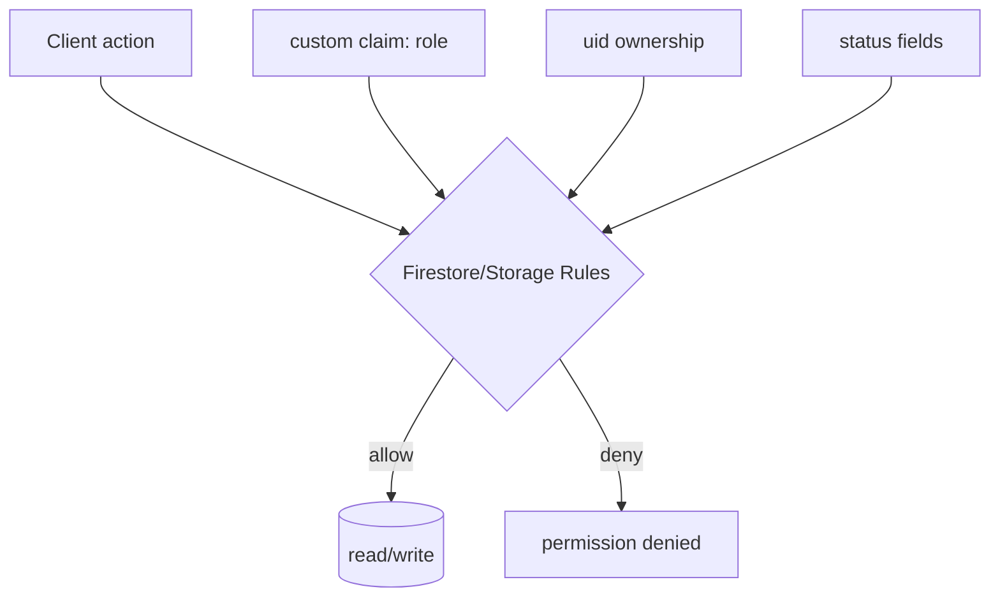

# 13 — Security

## Model

**Authorization is enforced server-side** by Firestore/Storage Security Rules + Firebase custom claims. Client guards and middleware are UX/defense-in-depth only.

## Roles & claims

- Roles (`student|recruiter|admin`) are **custom claims** set only server-side (Cloud Functions / Admin SDK). `users/{uid}.role` mirrors the claim.
- Clients cannot self-assign or elevate roles; `users` rules forbid changing `role`, toggling `isActive`, or self-verifying (`verificationStatus` limited to `unverified|pending`).

## Firestore Rules highlights (`Backend/firestore.rules`)

| Collection | Policy |
|------------|--------|
| `users` | read own/admin; student self-update cannot change role/isActive/verify |
| `students`, `academicDetails`, `professionalDetails`, `documents` | full owner CRUD; admin read |
| `recruiters` | read own/admin; write admin |
| `admins` | read own/admin; write **denied** (Admin SDK only) |
| `placementDrives` | read if signed-in **and** `status=='published'`; client write denied |
| `applications` | create by owner with `status=='pending'`; update/delete **denied** to clients |
| `notifications` | read own/broadcast; create own; update own |
| `otpRequests`, `mail` | **no client access** (functions only) |
| everything else | deny by default (catch-all) |

**Query-safety:** list queries are constrained to match the read rules (`status=='published'`, `studentId==uid`, `recipientId in [uid,'all']`) so Firestore accepts them.

## Storage Rules (`Backend/storage.rules`)

Objects under `students/{uid}/…` are **owner-only** read/write, with `contentType` restricted to `application/pdf` or `image/*` and size ≤ 10 MB. Photos are not stored here (Cloudinary).

## OTP security

- OTPs are **hashed** (SHA-256 + server pepper `OTP_PEPPER`), never stored in plaintext.
- **Expiry** 10 min · **resend cooldown** 45 s · **≤5 sends/hour** · **≤5 verify attempts**; records deleted on use/expiry.
- Domain gate (`@saitm.ac.in`) enforced on **client and server**.

## Session security

- Firebase-managed sessions (IndexedDB) with automatic token refresh.
- Recruiter/admin logins force a token refresh and **validate the role claim**, signing out mismatches.
- Logout clears the route-hint cookie and Firebase session.

## Middleware — explicitly UX, not a boundary

`middleware.ts` reads a **non-sensitive, client-set** route-hint cookie (`saitm-auth`) to redirect early. It can be forged; a forged cookie only changes which shell renders — **data reads are still denied by rules**, and client guards re-check on mount. This is the correct, race-free pattern for Firebase-client apps.

## Input validation

- All forms validate with **Zod** (types inferred via `z.infer`), client-side.
- Server callables re-validate (domain, OTP format, recruiter email/password, admin role).
- Firestore writes strip `undefined`/empty and rules assert required fields/immutability.

## Secrets & environment

- Only `NEXT_PUBLIC_*` (browser-safe Firebase web keys) are used client-side. No server secrets in the frontend.
- `.env.local` is git-ignored (once the repo is initialized); it currently holds empty placeholders (no committed secrets).
- Set a strong `OTP_PEPPER` on the Functions environment in production.

## Error handling

- Callable errors mapped to friendly messages; no stack/`digest` leaked to users beyond a reference id in `global-error`.
- `AuthProvider` never crashes on offline/permission errors.
- Route-level `error.tsx` / `global-error.tsx` provide branded fallbacks.

## Known gaps / hardening backlog

| Item | Status |
|------|--------|
| Firestore **Rules unit tests** (`@firebase/rules-unit-testing`) | 🟥 recommended, not present |
| Admin **2FA** | 🟥 2FA-ready, not enforced |
| Recruiter **self-edit** rules (Phase 5) | 🟥 write is admin-only today |
| App Check (anti-abuse on callables) | 🟥 not enabled |
| Server-side session cookies (edge verification) | 🟥 middleware is cookie-hint only |
| Rate limiting beyond OTP (e.g., callable abuse) | 🟡 partial (OTP only) |

## Best practices followed

Least-privilege rules · deny-by-default · server-side role assignment · hashed+rate-limited OTP · owner-scoped storage · centralized env access · no secrets in client bundle.
