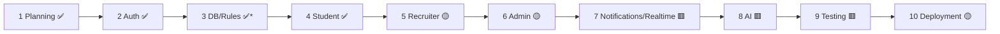

# 20 — Project Roadmap

Phased plan with **actual status**. Legend: ✅ done · 🟡 next/partial · 🟥 not started.

\* Student-side collections + rules are live; recruiter/admin/interview/offer collections are added with their phases.

## Delivered

| Phase | Scope | Status |
|-------|-------|--------|
| **1 — Planning & Architecture** | SDD (`docs/architecture/`), `CLAUDE.md`, `ARCHITECTURE.md` | ✅ |
| **2 — Authentication & Authorization** | 3-role auth (student OTP, recruiter register/verify/approval, admin secure login), custom claims, `users/{uid}`, RBAC guards, edge middleware, rules, 5 Cloud Functions | ✅ |
| **3 — Database & Rules (student scope)** | collections + Firestore/Storage rules + seed scripts | ✅ |
| **4 — Student Module** | onboarding wizard, dashboard + 13 pages, drives, eligibility engine + one-click apply, applications + timeline, notifications, shell | ✅ |

## In progress / next

### Phase 5 — Recruiter Workspace 🟡 (next)
Company profile · create placement drive (eligibility rules) · drive approval workflow · applicants list · resume review · shortlisting · interview scheduling · offer management · recruiter dashboard/analytics. New collections: `companies`, `interviews`, `offers` (+ rules/indexes). Backend `approveRecruiter` already exists.

### Phase 6 — Admin / TPO Console 🟡
Dashboard/KPIs · student **verification queue** (wire `reviewStudent`) · recruiter **approval queue** (wire `approveRecruiter`) · company/drive management + publish · applications/interviews oversight · announcements composer · reports & analytics · audit logs · role/permission management · settings. New collections: `activityLogs`, `settings`, `analytics`, dedicated `announcements`.

## Later

| Phase | Scope | Status |
|-------|-------|--------|
| **7 — Notifications & Realtime** | FCM push + device tokens · Firestore triggers fan-out · `onSnapshot` realtime · email transport wired | 🟥 |
| **8 — AI Features** | resume scoring (`resumeScore`) · job–candidate matching / recommendations · mock interview | 🟥 |
| **9 — Testing & Hardening** | unit (engines) · component (RTL) · E2E (Playwright/emulator) · **rules unit tests** · a11y/Lighthouse | 🟥 |
| **10 — Deployment & Ops** | Vercel + Firebase CI/CD · environments · monitoring · backups | 🟡 (deployable; CI/monitoring pending) |

## Immediate priorities (from the audit)

1. **P0** — Configure Firebase + Cloudinary (`.env.local`, deploy functions/rules, Trigger Email, seed admin).
2. **P0** — `git init` + CI (lint/typecheck/build/rules-tests).
3. **P1** — favicon/OG/logo assets; manual mobile/tablet UI pass.
4. **P1** — Firestore rules unit tests.
5. **P2** — Phase 5 (Recruiter) → Phase 6 (Admin); gate student placement actions on `verificationStatus='verified'`.
6. **P3** — cleanup: adopt/remove `ui/separator.tsx`; extract `initials()` helper; plan `next lint` → ESLint CLI migration.

## Not Yet Implemented (feature backlog beyond phases)

Resume Builder/Analyzer · Placement Readiness · Career Roadmap · Company Recommendations · Saved Companies · Placement Calendar · Achievements · Learning Center · Community · Portfolio · Public Profile · Support ticketing · dark mode. These are tracked here so they are neither lost nor mistaken for existing functionality.

---

**Reference:** the detailed pre-implementation design for each phase is in [`docs/architecture/12-roadmap.md`](./architecture/12-roadmap.md) and the module-specific SDD files.
