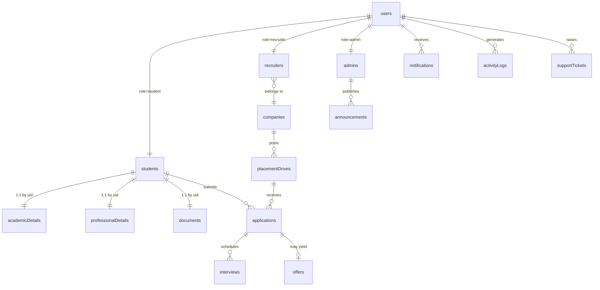

# 02 — Database Design (Cloud Firestore)

Firestore is a document database — there are **no server-side joins**. The design therefore follows three rules:

1. **Key by identity.** Per-user documents use the Firebase `uid` as the document id (`students/{uid}`).
2. **Denormalize for reads.** Embed the snapshot a screen needs (e.g., applicant + drive summary on an `application`) so lists render from a single query.
3. **Model queries first.** Every access pattern maps to a single-collection query with a supporting composite index.

Legend: ✅ Implemented · 🟡 Planned · 🔵 Future.

## Collection map

| Collection | Doc id | Status | Owner writes | Purpose |
|---|---|---|---|---|
| `users` | `{uid}` | 🟡 | self (limited) | Canonical identity + role + status |
| `students` | `{uid}` | ✅ | self | Student personal profile + onboarding meta |
| `academicDetails` | `{uid}` | ✅ | self | Academic record |
| `professionalDetails` | `{uid}` | ✅ | self | Skills, projects, links |
| `documents` | `{uid}` | ✅ | self | Document URLs |
| `recruiters` | `{uid}` | 🟡 | self + admin | Recruiter profile + approval state |
| `admins` | `{uid}` | 🟡 | super-admin | Admin profile + scope |
| `companies` | `{companyId}` | 🟡 | recruiter/admin | Company master |
| `placementDrives` | `{driveId}` | ✅ (read) | recruiter/admin | Drive/job posting |
| `applications` | `{uid}_{driveId}` | ✅ | self (create) | Application + status timeline |
| `interviews` | `{interviewId}` | 🟡 | recruiter/admin | Interview schedule |
| `offers` | `{offerId}` | 🟡 | recruiter/admin | Offer records |
| `notifications` | `{notificationId}` | ✅ | system/self | In-app notifications |
| `announcements` | `{announcementId}` | 🟡 | admin | Broadcast notices |
| `certificates` | `{certId}` | 🔵 | self + verifier | Verified certificates |
| `activityLogs` | `{logId}` | 🟡 | system | Audit trail |
| `supportTickets` | `{ticketId}` | 🟡 | any authed | Help desk |
| `settings` | `{scope}` | 🟡 | admin | System configuration |
| `analytics` | `{metricId}` | 🟡 | functions | Precomputed aggregates |
| `otpRequests` | `{emailHash}` | ✅ | functions only | OTP records (server-only) |
| `mail` | `{autoId}` | ✅ | functions only | Outbound email queue |

## Entity relationships

---

## `users/{uid}` 🟡
**Purpose:** Canonical identity and role record; the join point for role-specific collections. *(Current implementation stores `role` inside `students/{uid}`; introducing `users` is the recommended alignment for the 3-role system.)*

| Field | Type | Req | Notes |
|---|---|:--:|---|
| `uid` | string | ✅ | = doc id |
| `email` | string | ✅ | lowercased |
| `role` | enum `student\|recruiter\|admin` | ✅ | mirrors custom claim |
| `status` | enum `active\|pending\|suspended` | ✅ | recruiters start `pending` |
| `displayName` | string | – | |
| `photoUrl` | string(url) | – | Cloudinary |
| `createdAt` | timestamp | ✅ | server |
| `lastLoginAt` | timestamp | – | |

**Relationships:** 1:1 with one of `students`/`recruiters`/`admins`.
**Indexes:** single-field on `role`, `status`.
**Validation:** `email` matches RFC; `role`/`status` in enum.
**Security:** read self or admin; role/status writable only by Cloud Functions/admin (never self).

## `students/{uid}` ✅
**Purpose:** Student personal profile + onboarding meta.

| Field | Type | Req | Notes |
|---|---|:--:|---|
| `uid`,`email`,`role` | string | ✅ | role fixed `student` |
| `fullName` | string | ✅ | |
| `gender` | enum | ✅ | male/female/other |
| `dateOfBirth` | string(ISO) | ✅ | age 15–60 |
| `mobileNumber` | string | ✅ | `^[6-9]\d{9}$` |
| `alternateMobileNumber`,`aadhaarNumber` | string | – | Aadhaar 12 digits, never public |
| `category` | enum | ✅ | general/obc/sc/st/ews |
| `bloodGroup` | enum | – | |
| `address`,`city`,`state`,`pincode` | string | ✅ | pincode 6 digits |
| `photoUrl` | string(url) | – | Cloudinary |
| `profileCompleted` | boolean | ✅ | gates applications |
| `completionPercentage` | number | ✅ | 0–100 |
| `sections` | map<bool> | ✅ | personal/academic/professional/documents |
| `notificationPrefs`,`recruiterVisible` | map/bool | – | settings |
| `createdAt`,`updatedAt` | timestamp | ✅ | server |

**Relationships:** 1:1 → `academicDetails`, `professionalDetails`, `documents` (same uid).
**Indexes:** `profileCompleted`, `completionPercentage` (for admin reporting).
**Validation:** mirrors Zod `personalSchema` (client) + rules (server) — see [05](./05-security-rules.md).
**Security:** read/write self; `role` immutable to non-admin; admin read-all.

## `academicDetails/{uid}` ✅
**Purpose:** Academic record used by the eligibility engine.

| Field | Type | Notes |
|---|---|---|
| `enrollmentNumber`,`universityRollNumber` | string | |
| `course` | string | e.g. B.Tech |
| `branch` | string | full branch name |
| `currentYear`,`currentSemester`,`section` | string | |
| `admissionYear`,`expectedPassingYear` | string | eligibility |
| `tenthPercentage`,`twelfthPercentage`,`diplomaPercentage` | string(num) | 0–100 |
| `currentCgpa` | string(num) | 0–10 — eligibility |
| `activeBacklogs`,`totalBacklogsHistory` | string(int) | eligibility |
| `academicGap` | enum yes/no | |
| `academicStatus` | enum | regular/backlog/detained/passed |
| `resumeScore` | number | 🔵 AI |

**Relationships:** 1:1 with `students/{uid}`.
**Indexes:** none required (read by owner/recruiter by uid).
**Validation:** numeric ranges; strings validated by `academicSchema`.
**Security:** read/write self; recruiter/admin read when authorized (via application snapshot, not direct).

## `professionalDetails/{uid}` ✅
**Purpose:** Skills, projects and external profiles.

| Field | Type | Notes |
|---|---|---|
| `skills`,`programmingLanguages`,`frameworks`,`technologies`,`certifications` | string[] | eligibility uses `skills` |
| `projects` | array<{title,description?,link?}> | |
| `internshipExperience`,`workExperience` | string | |
| `github`,`linkedin`,`portfolio`,`leetcode`,`hackerrank`,`codechef`,`codeforces` | string | urls/handles |

**Relationships:** 1:1 with `students/{uid}`.
**Security:** read/write self; admin read-all.

## `documents/{uid}` ✅
**Purpose:** Document URLs (Firebase Storage) + passport photo (Cloudinary).

| Field | Type | Notes |
|---|---|---|
| `resumeUrl`,`tenthMarksheetUrl`,`twelfthMarksheetUrl` | string(url) | Firebase Storage |
| `passportPhotoUrl` | string(url) | Cloudinary |
| `semesterMarksheetUrls`,`certificateUrls` | string | Firebase Storage |

**Security:** read/write self; admin/authorized recruiter read. Storage objects live under `students/{uid}/…` with owner-scoped Storage Rules.

## `recruiters/{uid}` 🟡
**Purpose:** Recruiter profile + approval workflow.

| Field | Type | Notes |
|---|---|---|
| `uid`,`email`,`fullName`,`designation`,`phone` | string | |
| `companyId` | ref→companies | |
| `emailVerified` | boolean | |
| `approvalStatus` | enum `pending\|approved\|rejected` | admin-controlled |
| `approvedBy`,`approvedAt` | ref/timestamp | |
| `createdAt` | timestamp | |

**Indexes:** `approvalStatus`, `companyId`.
**Security:** read self + admin; `approvalStatus` writable by admin only.

## `admins/{uid}` 🟡
| Field | Type | Notes |
|---|---|---|
| `uid`,`email`,`fullName` | string | |
| `level` | enum `admin\|super_admin` | |
| `permissions` | string[] | fine-grained scopes |
| `createdAt` | timestamp | |

**Security:** read self + super-admin; writes by super-admin only.

## `companies/{companyId}` 🟡
| Field | Type | Notes |
|---|---|---|
| `name`,`website`,`industry`,`about` | string | |
| `logoUrl` | string(url) | Cloudinary |
| `locations` | string[] | |
| `createdBy` | ref→recruiters | |
| `verified` | boolean | admin |
| `createdAt` | timestamp | |

**Indexes:** `verified`, `industry`.
**Security:** read authed; write recruiter(own)/admin; `verified` admin-only.

## `placementDrives/{driveId}` ✅ (student read)
**Purpose:** A recruitment drive / job posting.

| Field | Type | Req | Notes |
|---|---|:--:|---|
| `companyName`,`companyLogoUrl` | string | ✅/– | logo Cloudinary |
| `role`,`jobType`,`packageLabel`,`location`,`description` | string | ✅ | |
| `skills`,`openings` | string[]/number | – | |
| `eligibility` | map | ✅ | `{courses[],branches[],minYear,minCgpa,maxActiveBacklogs,allowBacklogs,passingYears[],requiredSkills[]}` |
| `status` | enum `draft\|published\|closed` | ✅ | students read only `published` |
| `lastDate`,`driveDate` | timestamp | ✅ | |
| `createdBy`,`companyId` | ref | 🟡 | |
| `createdAt` | timestamp | ✅ | |

**Relationships:** 1→many `applications`; belongs to `companies`.
**Indexes:** composite `(status ASC, lastDate ASC)` for the student feed; `(companyId, status)` for recruiter view; `(status, driveDate)` for admin calendar.
**Validation:** required fields present; `eligibility` well-formed; dates coherent (`lastDate ≤ driveDate`).
**Security:** read if signed-in **and** `status == 'published'` (or owner/admin for any status); create/update recruiter(own, pre-approval)/admin; **publish** admin-only.

## `applications/{uid}_{driveId}` ✅
**Purpose:** A student's application; deterministic id enforces one-per-drive.

| Field | Type | Notes |
|---|---|---|
| `id`,`studentId`,`driveId` | string | id = `{studentId}_{driveId}` |
| `companyName`,`role`,`companyLogoUrl`,`packageLabel`,`location` | string | drive snapshot |
| `status` | enum | pending/under_review/shortlisted/interview_scheduled/selected/rejected/offer_released |
| `appliedAt`,`updatedAt` | timestamp | server |
| `timeline` | array<{status,atMs,note?}> | status history |
| `applicant` | map | snapshot: name,email,phone,course,branch,cgpa,resumeUrl,skills,photoUrl |

**Relationships:** many→1 `students`, many→1 `placementDrives`; 1→many `interviews`; 1→0..1 `offers`.
**Indexes:** `(studentId, appliedAt DESC)` — my applications; `(driveId, status)` — recruiter pipeline; `(driveId, appliedAt)` — recruiter list.
**Validation:** on create `studentId == auth.uid` and `status == 'pending'`.
**Security:** read owner/authorized recruiter/admin; **create** self only; **update/delete** recruiter(own drive)/admin only (status transitions server-side).

## `interviews/{interviewId}` 🟡
| Field | Type | Notes |
|---|---|---|
| `applicationId`,`driveId`,`studentId`,`companyId` | ref | |
| `mode` | enum `online\|onsite` | |
| `scheduledAt` | timestamp | |
| `location`/`meetingUrl` | string | |
| `round` | number | |
| `status` | enum `scheduled\|completed\|cancelled\|rescheduled` | |
| `feedback` | map | 🔵 |

**Indexes:** `(studentId, scheduledAt)`, `(driveId, scheduledAt)`.
**Security:** read student(own)/recruiter(own)/admin; write recruiter(own)/admin.

## `offers/{offerId}` 🟡
| Field | Type | Notes |
|---|---|---|
| `applicationId`,`studentId`,`companyId`,`driveId` | ref | |
| `packageLabel`,`joiningLocation`,`joiningDate` | string/timestamp | |
| `offerLetterUrl` | string(url) | Firebase Storage |
| `status` | enum `released\|accepted\|declined` | |
| `releasedAt` | timestamp | |

**Indexes:** `(studentId, releasedAt)`.
**Security:** read student(own)/recruiter(own)/admin; write recruiter(own)/admin; student may set `accepted\|declined` on own offer.

## `notifications/{notificationId}` ✅
| Field | Type | Notes |
|---|---|---|
| `recipientId` | string | uid or `"all"` (broadcast) |
| `type` | enum | drive/interview/selection/announcement/application/document/system |
| `title`,`message`,`link` | string | |
| `read` | boolean | personal only |
| `createdAt` | timestamp | |

**Indexes:** query is `where recipientId in [uid,'all']` (single-field, no composite); sorted client-side.
**Security:** read if `recipientId == uid || 'all'`; create self (own) or functions/admin; update (`read`) own only.

## `announcements/{announcementId}` 🟡
Institution-wide notices authored by admin; fan-out to `notifications` (recipientId `all`) or read directly.

| Field | Type | Notes |
|---|---|---|
| `title`,`body` | string | |
| `audience` | enum `all\|students\|recruiters` | |
| `pinned` | boolean | |
| `createdBy`,`createdAt` | ref/timestamp | |

**Security:** read authed (by audience); write admin only.

## `certificates/{certId}` 🔵
Verified certificate records (distinct from raw uploads in `documents`).

| Field | Type | Notes |
|---|---|---|
| `studentId`,`title`,`issuer`,`issueDate`,`url` | mixed | |
| `verified`,`verifiedBy` | boolean/ref | admin/faculty |

## `activityLogs/{logId}` 🟡
Append-only audit trail.

| Field | Type | Notes |
|---|---|---|
| `actorId`,`actorRole` | ref/enum | |
| `action` | string | e.g. `drive.published` |
| `entity`,`entityId` | string | |
| `meta` | map | before/after or context |
| `createdAt` | timestamp | |

**Indexes:** `(entity, createdAt)`, `(actorId, createdAt)`.
**Security:** create by functions; read admin only; no update/delete.

## `supportTickets/{ticketId}` 🟡
| Field | Type | Notes |
|---|---|---|
| `createdBy`,`role` | ref/enum | |
| `subject`,`description`,`category` | string | |
| `status` | enum `open\|in_progress\|resolved\|closed` | |
| `messages` | subcollection | thread |
| `createdAt`,`updatedAt` | timestamp | |

**Security:** read/write owner; admin read/write all.

## `settings/{scope}` 🟡
Singleton-style config docs (e.g., `settings/global`, `settings/placement`): active batch, application windows, feature flags, eligibility defaults.
**Security:** read authed; write admin only.

## `analytics/{metricId}` 🟡
Precomputed aggregates written by scheduled Cloud Functions (placement rate, package buckets, company participation, branch-wise stats) to keep dashboards cheap.
**Security:** read admin (and scoped read for recruiters/students where applicable); write functions only.

## `otpRequests/{emailHash}` ✅ · `mail/{autoId}` ✅
Server-only. `otpRequests` holds hashed OTP + expiry + rate-limit counters; `mail` is the outbound queue for the Trigger Email extension. **No client access** in any rule.

---

## Indexing summary (composite)

| Collection | Index | Serves |
|---|---|---|
| `placementDrives` | `status, lastDate` | student drive feed |
| `placementDrives` | `companyId, status` | recruiter drives |
| `applications` | `studentId, appliedAt` | my applications |
| `applications` | `driveId, status` | recruiter pipeline |
| `interviews` | `studentId, scheduledAt` | student interviews |
| `offers` | `studentId, releasedAt` | student offers |
| `activityLogs` | `entity, createdAt` | audit view |

Single-field indexes are auto-created by Firestore; composite indexes are declared in `Backend/firestore.indexes.json`.

## Data integrity & consistency

- **Transactions/batched writes** for multi-doc operations (apply = application + self-notification; onboarding = 4 profile docs).
- **Denormalized snapshots** are written at creation time and are intentionally immutable copies (the live source remains the profile).
- **Deterministic ids** (`{uid}_{driveId}`) prevent duplicate applications without a query.
- **Server timestamps** (`serverTimestamp()`) for all `createdAt`/`updatedAt`.
