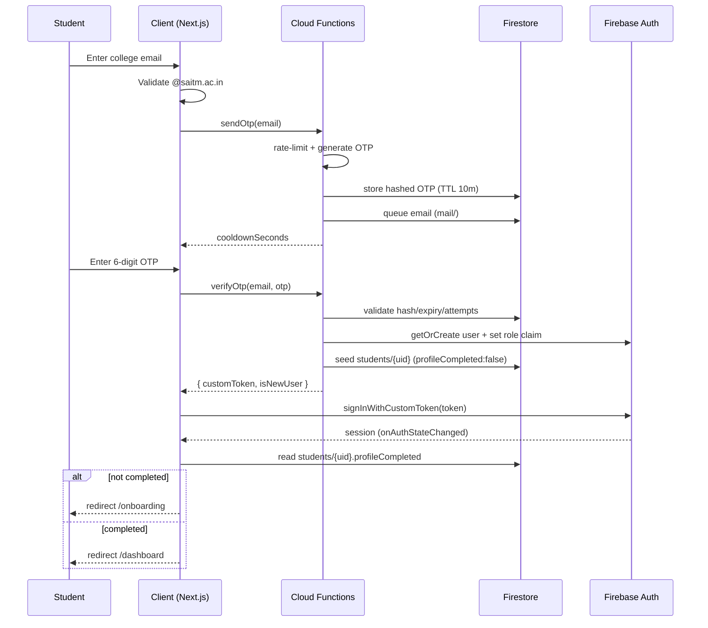
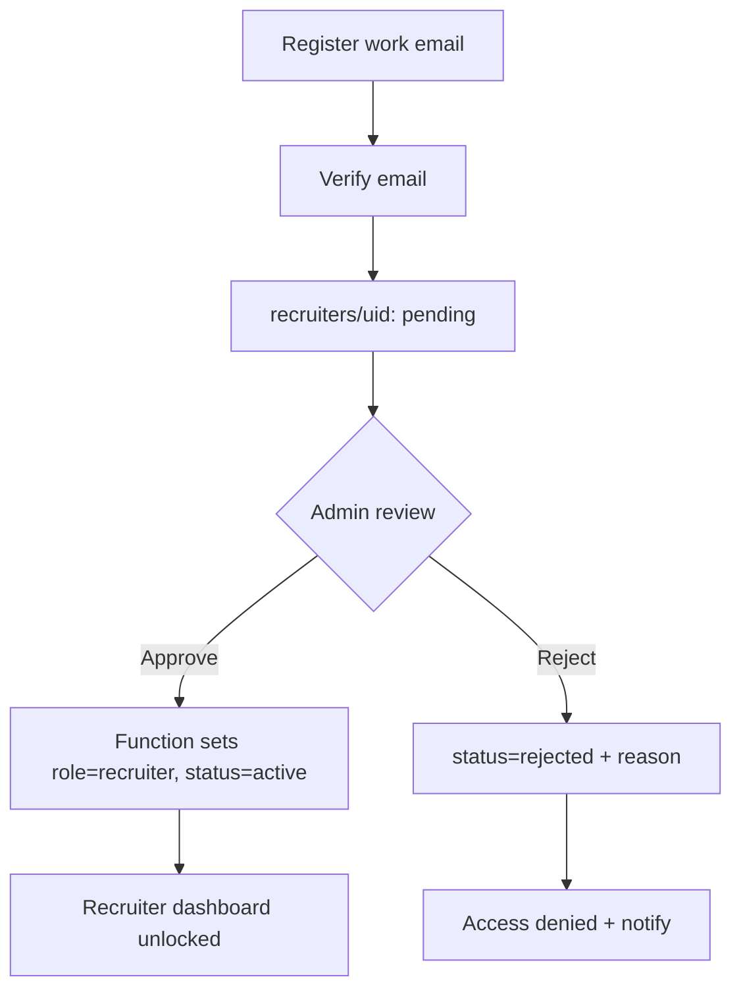
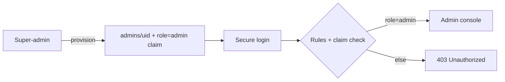

# 03 — Authentication & Authorization Flow

## Model

- **Identity provider:** Firebase Authentication.
- **Roles:** exactly one of `student | recruiter | admin`, carried as a **custom claim** on the ID token and mirrored in `users/{uid}.role`.
- **Authorization boundary:** Firestore Security Rules + Cloud Functions. Client-side guards (`RequireAuth`, middleware) are UX/defense-in-depth only.
- **Sessions:** Firebase SDK persists the session (IndexedDB) and auto-refreshes tokens. The client `AuthProvider` subscribes to `onAuthStateChanged` and resolves `{ user, role, profileMeta }` app-wide.

Firebase has **no native email-OTP** (its passwordless email method is a magic link). Student OTP is therefore implemented with **Cloud Functions + custom tokens**.

---

## 1. Student — Email OTP (✅ implemented)

### Flow
1. Student enters college email → client validates `@saitm.ac.in` (server re-validates).
2. `sendOtp` callable: validates domain, rate-limits, generates a 6-digit code, stores it **hashed** with a 10-minute TTL in `otpRequests/{emailHash}`, and queues an email (`mail` collection → Trigger Email extension).
3. Student enters the code → `verifyOtp` callable: checks hash, expiry and attempt count.
4. On success: get-or-create the Firebase user, set `role: student` custom claim, seed `students/{uid}` (`profileCompleted:false`), and return a **custom token**.
5. Client calls `signInWithCustomToken` → session established.
6. Router decision: `profileCompleted === false` → **Profile Completion Wizard**; else → **Dashboard**.

### Sequence



### First-login → Profile Completion
The wizard (4 steps: Personal mandatory; Academic/Professional/Documents optional) writes `students`, `academicDetails`, `professionalDetails`, `documents`, sets `profileCompleted:true` and `completionPercentage`, then routes to the dashboard. Sections may be edited later via deep links (`/onboarding?step=N`).

### Session handling
- Persisted by the Firebase SDK; token auto-refresh handled by SDK.
- `AuthProvider` exposes `{ user, loading, profile, refreshProfile, signOut }`.
- Route protection: `RequireAuth` (and `requireComplete`) redirect unauthenticated or incomplete users.
- Rate-limiting on OTP: 45s resend cooldown, 5 sends/hour, max 5 verify attempts, 10-minute expiry.

---

## 2. Recruiter — Verified + Admin-Approved (🟡 planned)

### Flow
1. Recruiter self-registers (work email + password **or** email link).
2. Email verification required.
3. `recruiters/{uid}` created with `approvalStatus: pending`; `users/{uid}.status: pending`.
4. Admin reviews and **approves/rejects**; on approval a Cloud Function sets the `role: recruiter` claim and `status: active`.
5. Only approved recruiters can create drives or view applicants.



**Gating:** pre-approval, a recruiter can only see an "awaiting approval" screen. Security Rules check `approvalStatus == 'approved'` for privileged writes.

---

## 3. Admin / Placement Cell — Secure RBAC (🟡 planned)

- Provisioned out-of-band by a **super-admin** (seed script / secured function); no public admin sign-up.
- Login via email + password (optionally with MFA 🔵).
- `role: admin` claim + `admins/{uid}` doc with `level` (`admin|super_admin`) and `permissions[]`.
- All admin mutations are recorded in `activityLogs`.



---

## Role resolution & route protection

```mermaid
flowchart TD
    Start[Request] --> Auth{Signed in?}
    Auth -- No --> Login[/login/]
    Auth -- Yes --> Claim{role claim}
    Claim -- student --> SGuard{profileCompleted?}
    SGuard -- No --> Onb[/onboarding/]
    SGuard -- Yes --> SDash[/dashboard/]
    Claim -- recruiter --> RGuard{approved?}
    RGuard -- No --> Pending[/recruiter/pending/]
    RGuard -- Yes --> RDash[/recruiter/*]
    Claim -- admin --> ADash[/admin/*]
    Claim -- none --> Unauthorized[/unauthorized/]
```

**Enforcement layers**
1. **Firestore Rules** — the real boundary (role claim + ownership + status).
2. **Cloud Functions** — privileged transitions (claims, approvals, status changes, custom tokens).
3. **Client guards** — `RequireAuth`, role-aware layouts, and (planned) `middleware.ts` for early redirects — UX only.

## Security considerations

- OTPs stored **hashed** (SHA-256 + server pepper), never in plaintext; expired/used records deleted.
- Domain check enforced on **client and server**.
- Custom claims are the source of truth for role; the mirrored `users` field is convenience only.
- Storage and Firestore reads for documents are owner-scoped; recruiters see applicant data only through authorized application access.
- Principle of least privilege across all rules; deny-by-default catch-all.
