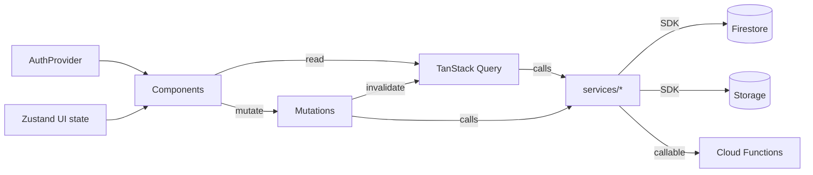

# 10 — State Management

State is split by **origin and lifetime**. Getting this boundary right is what keeps the app fast and bug-free.

| Kind | Owner | Tool | Examples |
|---|---|---|---|
| **Server / remote data** | TanStack Query | cache + fetch | drives, applications, profile, notifications |
| **Auth session** | React Context | `AuthProvider` | user, role, profile meta |
| **Ephemeral UI state** | Zustand (or local) | client store | sidebar collapsed, open modals, filters |
| **Form state** | React Hook Form | per-form | wizard steps, settings |
| **URL state** | Router | `useSearchParams` | `?q=`, `?step=`, filters |

**Golden rule:** remote data belongs to **TanStack Query**, never mirrored into Zustand. The store is for UI-only state.

## Server state — TanStack Query

- Configured in `QueryProvider` (staleTime 60s, gcTime 5m, retry 1, no refetch-on-focus).
- **Query key factory** (`constants/query-keys.ts`) for consistency and targeted invalidation.

| Domain | Key | Invalidated by |
|---|---|---|
| Full profile | `['full-profile', uid]` | onboarding save, profile edit |
| Drives | `['placement-drives']` | admin publish/close (via refetch) |
| One drive | `['placement-drive', id]` | drive update |
| My applications | `['applications', uid]` | apply mutation |
| Notifications | `['notifications', uid]` | mark-read, apply, new push |

- **Mutations** (apply, mark-read, save-profile, approve-recruiter…) invalidate the relevant keys `onSuccess`; errors surface via `onError` toasts.
- **Real-time (planned 🟡):** hot collections (notifications, application status) can upgrade from polling to Firestore `onSnapshot` listeners bridged into the query cache for instant updates.

## Auth state — Context

`AuthProvider` subscribes to `onAuthStateChanged`, reads the profile meta doc, and exposes `{ user, loading, profile, refreshProfile, signOut }` via `useAuth`. It is the single source for identity and gating; role comes from the token claim.

## UI state — Zustand / local

- `store/ui.store.ts` 🟡 — global UI flags (command palette, global modals).
- Local `useState` for component-scoped concerns (sidebar collapse persists to `localStorage`; OTP input; wizard step; list filters).

## Form state — React Hook Form + Zod

- Each step/form is an isolated RHF form with a Zod resolver; types are **inferred from schemas** (`z.infer`) so validation and types never drift.
- The onboarding wizard accumulates per-section values in the hook and commits atomically on finish.

## Caching strategy

- **Query cache** for reads (dedupes across components; e.g., `useNotifications` used by bell + right panel + page share one fetch).
- **HTTP/Next caching** for static/marketing content.
- **Cloudinary/Storage** assets are immutable, hashed URLs → long-lived browser cache.
- **Precomputed analytics** (`analytics/*`) so admin dashboards read aggregates, not scans.

## Offline support 🟡

- Firestore **offline persistence** (IndexedDB) for cached reads and queued writes.
- Query cache serves last-known data; UI shows non-blocking "offline" affordances.
- Mutations (apply, mark-read) queue and replay on reconnect where safe; conflicts resolved last-write-wins on non-critical fields.
- A future **PWA** shell enables installability and background sync. 🔵

## Data-flow summary

**Layering discipline:** components → hooks (Query) → services (pure data-access) → Firebase. Components never call services directly; services never touch React.
