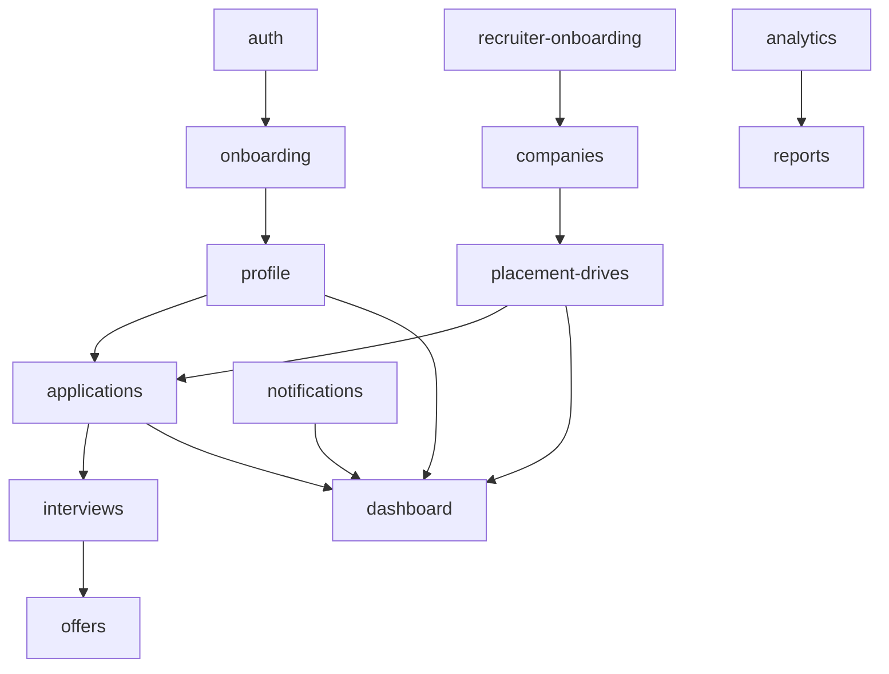

# 11 — Feature Mapping

Every feature mapped to its **module**, **dependencies**, **collections**, **APIs/functions**, and **key components**. Legend: ✅ built · 🟡 planned · 🔵 future.

## Student

| Feature | Status | Module | Depends on | Collections | APIs / Functions | Key components |
|---|---|---|---|---|---|---|
| Email-OTP auth | ✅ | `features/auth` | — | `otpRequests`, `mail`, `users`/`students` | `sendOtp`, `verifyOtp`, `signInWithCustomToken` | AuthCard, EmailStep, OtpStep, OtpInput |
| Onboarding wizard | ✅ | `features/onboarding` | auth, profile | `students`, `academicDetails`, `professionalDetails`, `documents` | Storage upload, Cloudinary upload | OnboardingWizard, StepIndicator, step forms, PhotoUpload, FileUpload |
| Profile view/edit | ✅ | `features/profile` | onboarding | 4 profile collections | — | Profile page, CompletionCard |
| Dashboard home | ✅ | `features/dashboard` | profile, drives, applications, notifications | (reads all) | — | WelcomeHero, StatTiles, CompletionCard, ApplicationStats |
| Placement drives | ✅ | `features/placement-drives` | applications (apply) | `placementDrives` | — | DriveCard, DriveDetailsDialog |
| Apply flow | ✅ | `features/applications` | profile, drives | `applications`, `notifications` | batched write (+self-notification) | ApplyButton, ApplyDialog, eligibility engine |
| My applications + timeline | ✅ | `features/applications` | — | `applications` | — | ApplicationRow, StatusTimeline, StatusBadge |
| Interviews | 🟡 | `features/interviews` | applications | `interviews` | — | InterviewList, InterviewCard |
| Offers | 🟡 | `features/offers` | applications | `offers` | accept/decline | OfferCard |
| Notifications | ✅ | `features/notifications` | — | `notifications` | (FCM 🟡) | NotificationBell, NotificationItem |
| Announcements | 🟡 | `features/announcements` | notifications | `announcements`/`notifications` | — | AnnouncementList |
| Resume/Documents/Skills | ✅ | profile views | onboarding | `documents`, `professionalDetails` | — | pages + upload |
| Settings | 🟡 | `features/settings` | profile | `students` | — | Settings page |
| Push (FCM) | 🟡 | `features/notifications` | — | device tokens | FCM send (function) | permission prompt |

## Recruiter 🟡

| Feature | Module | Depends on | Collections | APIs / Functions | Key components |
|---|---|---|---|---|---|
| Registration + verification | `features/recruiter-onboarding` | auth | `recruiters`, `users` | email verify, `approveRecruiter` | RegisterForm, PendingScreen |
| Company profile | `features/companies` | media | `companies` | Cloudinary logo | CompanyForm, CompanyCard |
| Job/drive posting | `features/placement-drives` | companies | `placementDrives` | (admin approval) | JobForm, DriveCard |
| Candidate search | `features/candidates` | profile snapshots | `applications`, `students`* | query/filter | CandidateCard, DataTable, Filters |
| Shortlisting | `features/candidates` | applications | `applications` | status update (function) | ShortlistTable |
| Interview scheduling | `features/interviews` | applications | `interviews`, `notifications` | ScheduleInterview (function) | ScheduleInterviewDialog |
| Selection / offers | `features/offers` | applications | `offers`, `notifications` | releaseOffer (function) | OfferForm |
| Recruiter dashboard | `features/dashboard` | above | (reads) | analytics | KPIs, PipelineFunnel |

\* Recruiters read applicant data via the **application snapshot** and authorized reads, not arbitrary student docs.

## Admin / Placement Cell 🟡

| Feature | Module | Depends on | Collections | APIs / Functions | Key components |
|---|---|---|---|---|---|
| Admin dashboard | `features/dashboard` | analytics | `analytics` | aggregation (scheduled) | KpiRow, charts |
| Student management | `features/admin-students` | profile | `students`, `academicDetails`… | suspend/reset (function) | DataTable, StudentDetail |
| Recruiter approvals | `features/admin-recruiters` | recruiter-onboarding | `recruiters`, `users` | `approveRecruiter` (sets claim) | ApprovalTable |
| Company management | `features/companies` | — | `companies` | verify | CompanyTable |
| Drive management/approval | `features/placement-drives` | companies | `placementDrives` | publish/close (function) | DriveForm, ApprovalActions |
| Applications oversight | `features/applications` | — | `applications` | status override | PipelineTable |
| Interviews/Offers oversight | `features/interviews`,`offers` | — | `interviews`, `offers` | — | Calendars/Tables |
| Announcements | `features/announcements` | notifications | `announcements`, `notifications` | fan-out (trigger) | AnnouncementComposer |
| Reports & Analytics | `features/reports`,`analytics` | data | `analytics`, source collections | export, aggregation | Charts, ExportButton |
| Support tickets | `features/support` | — | `supportTickets` | — | TicketList, TicketThread |
| Activity logs | `features/activity-logs` | — | `activityLogs` | — | LogTable |
| Settings & user mgmt | `features/settings` | — | `settings`, `users` | setRole (function) | SettingsPanels, RoleManager |

## Cross-cutting dependencies

## Shared platform services

| Service | Used by |
|---|---|
| `lib/firebase/client` | every feature |
| `lib/cloudinary/upload` | onboarding, companies, media (images) |
| `lib/storage/upload` | onboarding, offers (documents) |
| `features/notifications` (fan-out) | apply, drive publish, interview, offer, announcement |
| Cloud Functions (claims, approvals, status, tokens) | auth, recruiter, admin, applications |
