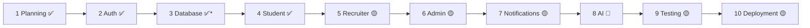

# 12 — Development Roadmap

Phased delivery. Each phase lists **goal, deliverables, dependencies, and exit criteria**. Status reflects current progress. Legend: ✅ done · 🟡 in progress/next · 🔵 later.

## Snapshot

\*Student-side collections + rules are live; recruiter/admin/interview/offer collections are designed and added incrementally with their phases.

## Phase 1 — Planning & Architecture ✅
- **Goal:** complete SDD before implementation.
- **Deliverables:** SRS, DB design, auth flow, folder structure, security-rules design, navigation, routing, component architecture, design system, state management, feature mapping, this roadmap; `CLAUDE.md`, `ARCHITECTURE.md`.
- **Exit:** documents reviewed and approved.

## Phase 2 — Authentication ✅
- **Goal:** secure student sign-in.
- **Deliverables:** email-OTP via Cloud Functions + custom tokens; domain gate; `AuthProvider`/`RequireAuth`; rate-limiting; error/404 boundaries.
- **Depends on:** Phase 1.
- **Exit:** student can sign in; role claim set; session persists. *(Recruiter/admin auth deferred to Phases 5–6.)*

## Phase 3 — Database & Rules Foundation ✅ (student scope)
- **Goal:** collections, indexes, security rules for the student domain.
- **Deliverables:** `students`, `academicDetails`, `professionalDetails`, `documents`, `placementDrives`, `applications`, `notifications`; `firestore.rules`, `storage.rules`, indexes; seed script.
- **Exit:** rules enforce ownership/role; queries index-backed; emulator-tested.

## Phase 4 — Student Panel ✅
- **Goal:** full student experience.
- **Deliverables:** onboarding wizard; profile; premium dashboard; drives; **eligibility engine + one-click apply**; applications + timeline; notifications; all 13 nav pages; shell (collapsible sidebar, topbar, right panel).
- **Depends on:** Phases 2–3.
- **Exit:** build green (0 type errors); live smoke test passes; verified UX.

## Phase 5 — Recruiter Panel 🟡 (next)
- **Goal:** recruiter onboarding and hiring workflow.
- **Deliverables:** recruiter registration + verification + **admin approval**; `recruiters`, `companies` collections + rules; company profile; job/drive posting (draft→approval); candidate search & shortlist; interview scheduling; offers; recruiter dashboard.
- **Depends on:** Phase 4; partial Phase 6 (approval).
- **Exit:** approved recruiter can post a drive, view eligible applicants, shortlist, schedule, and release an offer.

## Phase 6 — Admin / Placement Cell Panel 🟡
- **Goal:** central operations & governance.
- **Deliverables:** admin provisioning + RBAC; manage students/recruiters/companies; drive approval/publish/close; applications & interviews oversight; announcements; reports & analytics; support tickets; activity logs; settings & user management; `admins`, `activityLogs`, `settings`, `analytics` collections + rules.
- **Depends on:** Phases 4–5.
- **Exit:** admin can approve recruiters, publish drives, advance statuses, broadcast announcements, and view analytics; all privileged actions logged.

## Phase 7 — Notifications & Realtime 🟡
- **Goal:** timely, multi-channel updates.
- **Deliverables:** Firestore triggers fan-out (drive publish, status change, interview, offer, announcement); **FCM push** + device-token management; realtime `onSnapshot` for notifications/status; email transport wired (Trigger Email/SendGrid).
- **Depends on:** Phases 4–6.
- **Exit:** stakeholders receive in-app + push notifications in near-real-time.

## Phase 8 — AI Features 🔵
- **Goal:** intelligent assistance.
- **Deliverables:** resume scoring (`resumeScore`) + improvement tips; job–candidate matching / recommended drives; optional aptitude-test integration.
- **Depends on:** stable data from Phases 4–6.
- **Exit:** AI features behind flags with measurable quality; privacy-reviewed.

## Phase 9 — Testing & Hardening 🟡 (continuous)
- **Goal:** correctness, security, performance.
- **Deliverables:** unit (engines/helpers), component (RTL), E2E (Playwright on emulator) for login→onboarding→apply and recruiter/admin flows; **Rules unit tests** (allow/deny matrix); Lighthouse/a11y audits; load checks on hot queries.
- **Depends on:** each feature phase.
- **Exit:** CI green (typecheck, lint, tests, build); a11y AA; Lighthouse ≥ 90.

## Phase 10 — Deployment & Operations 🟡
- **Goal:** production launch.
- **Deliverables:** Vercel (frontend) + Firebase (Functions, rules, indexes, Storage) CI/CD; environments (dev/staging/prod) with `.firebaserc` aliases; secrets/env management; monitoring (function logs, error reporting), backups, and runbooks; staged rollout.
- **Depends on:** Phase 9.
- **Exit:** production live with monitoring, backups, and rollback.

## Cross-phase workstreams
- **Design system & accessibility** — maintained every phase.
- **Security** — rules + tests evolve with each new collection.
- **Docs** — `ARCHITECTURE.md` and this SDD updated as structure evolves.

## Suggested milestones
- **M1 (done):** Student MVP (Phases 1–4).
- **M2:** Recruiter + Admin core (Phases 5–6) → end-to-end placement loop.
- **M3:** Notifications/realtime + testing hardening (Phases 7, 9).
- **M4:** Production launch (Phase 10) → then AI (Phase 8).
